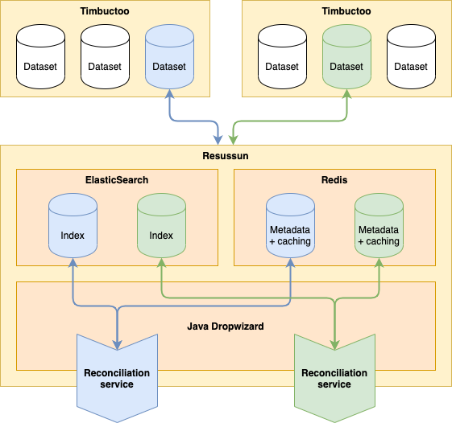

# Resussun

Resussun is an implementation of the [Reconciliation Service API](#https://reconciliation-api.github.io/specs/0.1/), 
providing reconciliation endpoints for datasets from [Timbuctoo](#https://github.com/HuygensING/timbuctoo) instances.

1. [Running the service](#running-the-service)
    1. [Use a local build](#use-a-local-build)
    1. [Use docker-compose.yml](#use-docker-composeyml)
    1. [Use docker-compose-local.yml](#use-docker-compose-localyml)
1. [How the service is built up](#how-the-service-is-built-up)
1. [Mapping and searching](#mapping-and-searching)
    1. [How the data is mapped and searched](#how-the-data-is-mapped-and-searched)
    1. [An example](#an-example)
1. [API](#api)
    1. [Web interface](#web-interface)
    1. [Admin interface](#admin-interface)

## Running the service

### Use a local build
1. Run `mvn clean install` to build your application
1. Start application with `./target/appassembler/bin/resussun server config.yml`
1. To check that your application is running enter url `http://localhost:8080`

### Use docker-compose.yml
1. Run the docker-compose file: `docker-compose -f docker/docker-compose.yml up -d`  
1. To check that your application is running enter url `http://localhost:8080`

### Use docker-compose-local.yml
This docker-compose uses the local build to run with Elasticsearch and Redis.
1. Run `mvn clean install` to build your application
1. Run the docker-compose file: `docker-compose -f docker/docker-compose-local.yml up -d`  
1. To check that your application is running enter url `http://localhost:8080`

## How the service is built up

Resussun is a service written in Java using the [Dropwizard](#https://www.dropwizard.io) framework. 
It makes use of [ElasticSearch](#https://www.elastic.co/elasticsearch) as the search engine 
and [Redis](#https://redis.io) for the storage of metadata and to provide caching.



Through the admin interface an administrator can create reconciliation services for any number of configured datasets 
from various Timbuctoo instances. Resussun will use the [GraphQL](#https://graphql.org) interface 
provided by Timbuctoo to obtain and index the data in ElasticSearch. Various metadata, like the URL of the Timbuctoo
instance where the data is hosted and the URL of the Timbuctoo GUI, is stored in Redis. 

Resussun will use the metadata stored in Redis to provide a new reconciliation service endpoint 
and with it a [service manifest](#https://reconciliation-api.github.io/specs/0.1/#service-manifest). 
All [reconciliation queries](#https://reconciliation-api.github.io/specs/0.1/#sending-reconciliation-queries-to-a-service) 
sent to the endpoint are transformed as queries to the ElasticSearch index and those results are then 
transformed back to [reconciliation candidates](#https://reconciliation-api.github.io/specs/0.1/#reconciliation-candidates).
Various other requests, for example to the [suggest services](#https://reconciliation-api.github.io/specs/0.1/#suggest-services)
or to the [data extension service](#https://reconciliation-api.github.io/specs/0.1/#data-extension-service), 
are transformed to GraphQL queries to Timbuctoo, before being transformed back to results according to the specification.

## Mapping and searching

### How the data is mapped and searched 

In the specification three important [core concepts](#https://reconciliation-api.github.io/specs/0.1/#core-concepts) 
are defined: entities, types and properties. In Timbuctoo we also recognize entities within a dataset, 
as well as properties on those entities. However, each entity in a dataset is placed in a `collection` 
based on the `rdf_type`. So, the mapping of the core concepts to those from Timbuctoo is:
- **Entity**: Entity in Timbuctoo
- **Type**: The `rdf_types` in Timbuctoo
- **Properties**: Properties of the entities in Timbuctoo

For each entity, Timbuctoo recognizes by default four fields:
- `uri`: The URI of the entity, and used as the identifier in the reconciliation service
- `title`: A title of the entity, but may fall back to the URI as value
- `description`: A description of the entity, if available
- `image`: A link to an image of the entity, if available

In ElasticSearch, each entity is indexed using the `uri` as the identifier. Furthermore, we index the `rdf_type` 
and the `collection` the entity belongs to as keywords for filtering. Furthermore, the `title` is indexed as a text field,
as it is the most accurate description of the entity. All other properties of the entity are concatenated and indexed
as a separate text field for additional search data. This results in the following mapping:

```json5
{
  "properties": {
    "uri": {
      "type": "keyword"
    },
    "types": {
      "type": "keyword"
    },
    "collectionIds": {
      "type": "keyword"
    },
    "title": {
      "type": "text"
    },
    "values": {
      "type": "text"
    }
  }
}
```     

In order to search for candidates, the following ElasticSearch query is constructed: 
a [multi match query](#https://www.elastic.co/guide/en/elasticsearch/reference/current/query-dsl-multi-match-query.html)
is used to match the given query on both the `title` and the `values` fields. As the `title` is more important, 
it's score is boosted by 5. We use the `most_fields` type to find entities which match any of the two fields
and which will combine the scores from both fields. 

If one or more types are passed along with the query, we have to add a filter to the ElasticSearch query. In order
to do so we use a [boolean query](#https://www.elastic.co/guide/en/elasticsearch/reference/current/query-dsl-bool-query.html).
The boolean query will use the multi match query as a `must`. 
But will use a [term query](#https://www.elastic.co/guide/en/elasticsearch/reference/current/query-dsl-term-query.html) 
for the type(s) as a `filter`.

This results in the following query:
```json5
{
  "query": {
    "bool": {
      "must": {
        "multi_match": {
          "query": "<query>", // The query
          "fields": [
            "title^5.0", // Boost score on the title field by 5
            "values^1.0"
          ],
          "type": "most_fields"
        }
      },
      "filter": {
        "term": {
          "types": "<type>" // One or more types to filter on
        }
      }
    }
  }
}
```

### An example

As an example, we will be using the [DWC dataset](#https://data.huygens.knaw.nl/details/u74ccc032adf8422d7ea92df96cd4783f0543db3b__dwc) 
with dataset id `u74ccc032adf8422d7ea92df96cd4783f0543db3b__dwc` 
from the Huygens ING Timbuctoo instance: `https://repository.huygens.knaw.nl`.

The following query is sent to the Timbuctoo GraphQL interface to obtain the properties of the entity with the uri
`http://example.org/datasets/u33707283d426f900d4d33707283d426f900d4d0d/bia/collection/Places_PL00000011` from the
`dwc_col_Places` collection:
```graphql
query {
  dataSets {
    u74ccc032adf8422d7ea92df96cd4783f0543db3b__dwc {
      dwc_col_Places(uri: "http://example.org/datasets/u33707283d426f900d4d33707283d426f900d4d0d/bia/collection/Places_PL00000011") {
        uri

        title {
          value
        }
        description {
          value
        }
        image {
          value
        }

        rdf_type {
          uri
        }

        dwc_pred_Country {
          value
        }
        schema_nameList {
          items {
            value
          }
        }
        http___www_geonames_org_ontology_countryCode {
          value
        }
      }
    }
  }
}
```

Besides the default four properties, we also request the properties for the country, name and country code. This results
in the following response:
```json5
{
  "data": {
    "dataSets": {
      "u74ccc032adf8422d7ea92df96cd4783f0543db3b__dwc": {
        "dwc_col_Places": {
          "uri": "http://example.org/datasets/u33707283d426f900d4d33707283d426f900d4d0d/bia/collection/Places_PL00000011",
          "title": {
            "value": "Amsterdam"
          },
          "description": null,
          "image": null,
          "rdf_type": {
            "uri": "http://example.org/datasets/u33707283d426f900d4d33707283d426f900d4d0d/bia/collection/Places"
          },
          "dwc_pred_Country": {
            "value": "Netherlands"
          },
          "schema_nameList": {
            "items": [
              {
                "value": "Amsterdam"
              }
            ]
          },
          "http___www_geonames_org_ontology_countryCode": {
            "value": "NL"
          }
        }
      }
    }
  }
}
```

This will be indexed in ElasticSearch as:
```json5
{
  "uri": "http://example.org/datasets/u33707283d426f900d4d33707283d426f900d4d0d/bia/collection/Places_PL00000011",
  "types": ["http://example.org/datasets/u33707283d426f900d4d33707283d426f900d4d0d/bia/collection/Places"],
  "collectionIds": ["dwc_col_Places"],
  "title": "Amsterdam",
  "values": "Netherlands Amsterdam NL"
}
```

## API

### Web interface

_We assume the web interface is running on localhost on port 8080_

**URL**: `/`\
**Method**: `GET`

**curl**: `curl -X GET http://localhost:8080`

Returns a JSON serialized list of URLs to all provided reconciliation service endpoints.

---

**URL**: `/{dataSetId}`\
**Method**: `GET`

**curl**: `curl -X GET http://localhost:8080/{dataSetId}`

Returns a [service manifest](#https://reconciliation-api.github.io/specs/0.1/#service-manifest) 
for a reconciliation service with the given `dataSetId`.

Consult this manifest for the various other endpoints 
and consult the [Reconciliation Service API](#https://reconciliation-api.github.io/specs/0.1) on how to use them.

---

### Admin interface

_We assume the admin interface is running on localhost on port 8081_

**URL**: `/healthcheck`\
**Method**: `GET`

**curl**: `curl -X GET http://localhost:8081/healthcheck`

Shows the applications health.

---

**URL**: `/tasks/createIndex`\
**Method**: `POST`\
**Parameters**: `dataSetId`, `timbuctooUrl`, `timbuctooGuiUrl`

**curl**: `curl -X POST --data "dataSetId={dataSetId}&timbuctooUrl={timbuctooUrl}&timbuctooGuiUrl={timbuctooGuiUrl}" http://localhost:8081/tasks/createIndex`

Creates a new index (reconciliation service endpoint) for a dataset with the given `dataSetId` 
from the given `timbuctooUrl`. The `timbuctooGuiUrl` of the corresponding GUI of this Timbuctoo instance is also given.
These parameters and their values are stored as metadata in Redis.

---

**URL**: `/tasks/deleteIndex`\
**Method**: `POST`\
**Parameters**: `dataSetId`

**curl**: `curl -X POST --data "dataSetId={dataSetId}" http://localhost:8081/tasks/deleteIndex`

Deletes a index (reconciliation service endpoint) with the given `dataSetId`.
